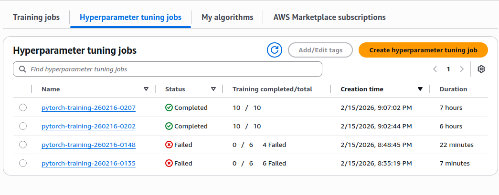
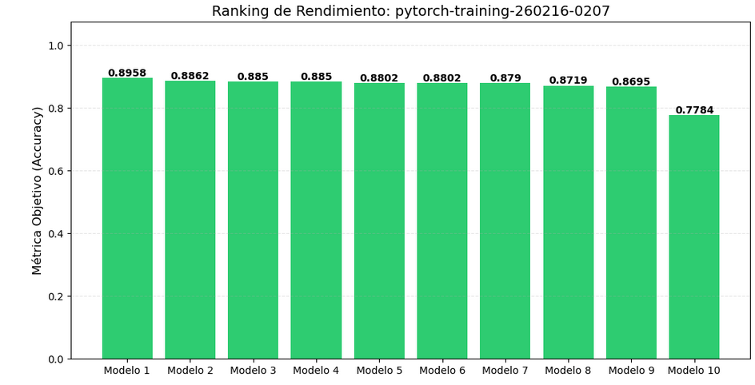
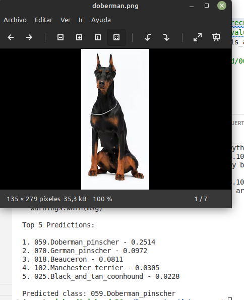

# 🐶 Dog Breed Classification with PyTorch & SageMaker

Deep Learning project using **Transfer Learning with ResNet50**, optimized through **Hyperparameter Tuning (HPO)** on AWS SageMaker, including Debugger and Profiler integration.

---

## 📌 Project Overview

This project implements a CNN-based image classification pipeline for dog breed recognition using:

* **PyTorch**
* **Pretrained ResNet50 (ImageNet)**
* **AWS SageMaker**
* Hyperparameter Optimization (HPO)
* SageMaker Debugger & Profiler

The final model achieved:

> 🎯 **89.58% Validation Accuracy**

---

# ⚙️ Environment Setup

## 1️⃣ Create Virtual Environment

```bash
python3 -m venv dog_proj_env
source dog_proj_env/bin/activate
```

---

## 2️⃣ Install Dependencies

```bash
pip install torch torchvision numpy Pillow smdebug sagemaker pandas matplotlib
```

---

## 3️⃣ Download Dataset

```bash
wget https://s3-us-west-1.amazonaws.com/udacity-aind/dog-project/dogImages.zip
unzip dogImages.zip
```

Upload the dataset to S3 before training in SageMaker.

---

# 🧠 Model Architecture

### 🔹 Base Model

* **ResNet50 (IMAGENET1K_V2)**
* Pretrained on ImageNet

### 🔹 Transfer Learning Strategy

* All early convolutional layers frozen
* `layer4` unfrozen for domain adaptation
* Fully Connected (`fc`) layer replaced to match dataset classes

### 🔹 Input Pipeline

* Resize to 224x224
* Random horizontal flips (training only)
* ImageNet normalization:

  * Mean: `[0.485, 0.456, 0.406]`
  * Std: `[0.229, 0.224, 0.225]`

---

# 🐞 Debugging & Profiling (SageMaker)

Integrated with **smdebug** to:

* Monitor `CrossEntropyLoss`
* Track GPU/CPU utilization
* Detect non-decreasing loss patterns
* Profile hardware performance

---

# 🚀 Hyperparameter Optimization

The model was optimized using **SageMaker HPO**, exploring:

* Learning rate (`lr`)
* Batch size (`batch_size`)

### 🔎 Tuning Jobs Overview



---

## 📊 Top 10 Models – Accuracy Comparison



---

## 📋 Hyperparameter Results

| Model        | Accuracy     | Batch Size | Learning Rate | Time (s) |
| ------------ | ------------ | ---------- | ------------- | -------- |
| **Modelo 1** | **0.895808** | **58**     | **7.42e-05**  | **4653** |
| Modelo 2     | 0.886228     | 45         | 5.90e-05      | 4244     |
| Modelo 3     | 0.885030     | 33         | 7.10e-05      | 4393     |
| Modelo 4     | 0.885030     | 64         | 1.02e-04      | 4498     |
| Modelo 5     | 0.880240     | 61         | 1.35e-04      | 4302     |
| Modelo 6     | 0.880240     | 57         | 5.80e-05      | 4258     |
| Modelo 7     | 0.879042     | 24         | 3.50e-05      | 4452     |
| Modelo 8     | 0.871856     | 16         | 1.02e-04      | 4168     |
| Modelo 9     | 0.869461     | 16         | 7.30e-05      | 4222     |
| Modelo 10    | 0.778443     | 35         | 7.80e-03      | 4388     |

---

# 🏆 Best Model

```
Validation Accuracy: 0.895808
Batch Size: 58
Learning Rate: 7.4278e-05
Training Time: 4653 seconds
Training Job: pytorch-training-260216-0207-002-4c761cbf
```

🎯 **Final Accuracy: 89.58%**

---

# 🐕 Inference Test – Real-World Image

After deployment to a SageMaker endpoint, the model was tested using an external Doberman image.



✅ The model correctly classified the image as **Doberman**.

This confirms:

* Effective fine-tuning
* Robust feature extraction
* Strong generalization capability

---

# ▶️ Training

## Run Locally

```bash
export SM_CHANNEL_TRAIN="./data"
export SM_MODEL_DIR="./model_output"

python train_model.py --batch_size 32 --epochs 5 --lr 0.001
```

---

## Run on SageMaker

```python
from sagemaker.pytorch import PyTorch

estimator = PyTorch(
    entry_point='train_model.py',
    role=role,
    instance_count=1,
    instance_type='ml.g4dn.xlarge',
    framework_version='2.0',
    py_version='py310',
    hyperparameters={
        'batch_size': 64,
        'epochs': 10,
        'lr': 0.001
    }
)

estimator.fit({'train': 's3://your-bucket/dog-project/'})
```

---

# 📈 Logged Metrics

The script outputs metrics in SageMaker-compatible format:

```
validation:accuracy=<value>
test:accuracy=<value>
```

Final model artifact:

```
model.pth
```

Stored in the S3 output path.

---

# 🏁 Conclusion

This project demonstrates:

* Effective Transfer Learning
* Systematic Hyperparameter Optimization
* Production-ready SageMaker integration
* Real-world inference validation

Final performance reached **89.58% validation accuracy**, proving that pretrained CNN architectures provide strong baselines for domain-specific classification tasks.

---

# 🚀 Future Improvements

* Vision Transformers (ViT) benchmarking
* EfficientNet comparison
* Advanced augmentation (CutMix, MixUp)
* Quantization & pruning
* ONNX/TFLite export for edge deployment

---


